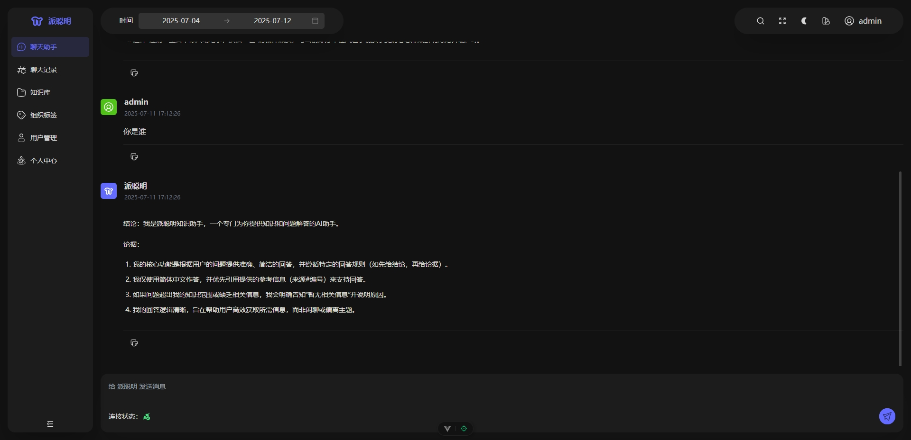
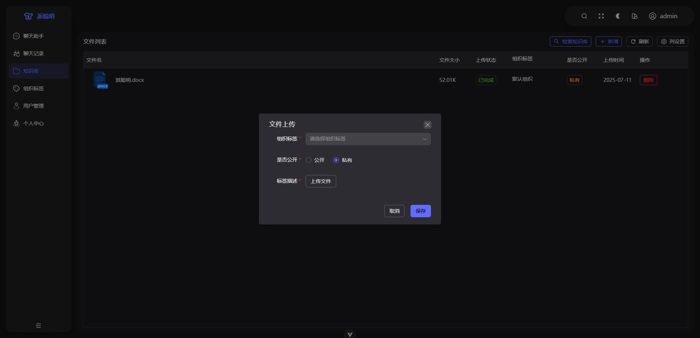
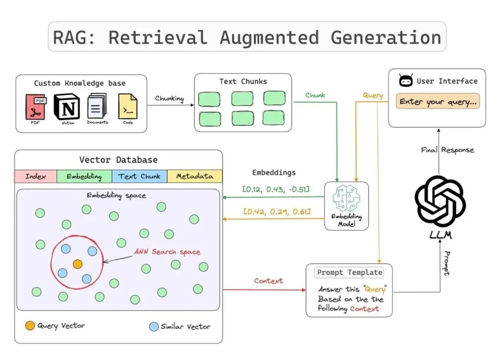
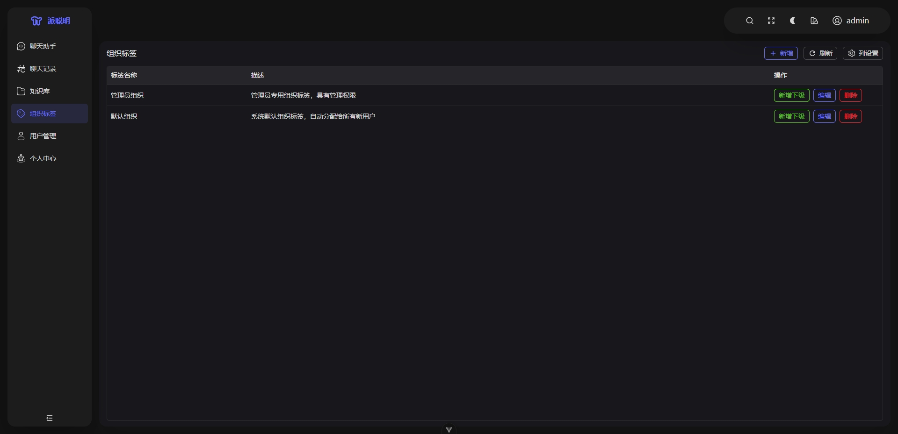

<div align="center">

# ChuYu知识库

**企业级 AI 知识管理系统 — 基于 RAG 的智能文档处理与检索平台**

[](https://www.oracle.com/java/)
[](https://spring.io/projects/spring-boot)
[](https://vuejs.org/)
[](LICENSE)

[功能特性](#-功能特性) · [技术架构](#-技术架构) · [快速开始](#-快速开始) · [系统截图](#-系统截图) · [API 文档](#-api-文档)

</div>

---

## 项目简介

 是一个面向企业场景的 AI 知识管理平台，核心采用 **RAG（检索增强生成）** 架构，实现从文档上传、智能解析、向量化存储到语义检索与 AI 对话的完整闭环。系统支持多模态文档处理（PDF 识图、图片 OCR、文本解析）、多租户组织权限隔离、混合检索（向量 + 关键词）以及可扩展的 AI Agent 体系。

### 核心亮点

- **多模态文档处理**：PDF 截图识图提取文本、图片 VL 模型识别、Tika 通用解析，覆盖全类型文档
- **混合检索引擎**：KNN 向量语义搜索 + BM25 关键词匹配，双路召回 + 重排序，显著提升检索召回率
- **多租户权限隔离**：基于组织标签的层级权限体系，支持私有空间、组织共享、公开文档三级访问控制
- **异步处理流水线**：Kafka 驱动的文件解析与向量化，支持大文件分片上传、断点续传
- **AI Agent 扩展**：支持 MCP（Model Context Protocol）工具集成，用户可自定义 Agent 接入外部工具
- **流式对话体验**：WebSocket 实时流式输出，支持停止生成、对话历史管理

---

## 功能特性

### 智能文档处理

| 文档类型 | 处理方式 | 向量化模型 |
|---------|---------|-----------|
| PDF | PDFBox 逐页截图 → GLM-4.6V 视觉模型识图 | Qwen3-VL-Embedding-8B (4096维) |
| 图片 (JPG/PNG/BMP等) | GLM-4.6V 视觉模型识别 | Qwen3-VL-Embedding-8B (4096维) |
| 文本 (TXT/MD/DOC/DOCX等) | Apache Tika 文本提取 | Qwen3-VL-Embedding-8B (4096维) |

- **语义分块**：段落 → 句子 → HanLP 分词，父子分块策略（1MB 父块 / 512 字符子块）
- **PDF 页面重叠**：相邻页面文本重叠 200 字符，避免跨页语义断裂
- **断点续传**：5MB 分片上传，Redis Bitmap 追踪已传分片

### 混合检索 (RAG)

```
用户提问 → Query 向量化 → KNN 向量召回 + BM25 关键词匹配 → 权限过滤 → 重排序 → 上下文构建 → LLM 生成
```

- **双路召回**：Elasticsearch KNN + BM25，向量语义匹配与关键词精确匹配互补
- **权限过滤**：仅返回用户有权访问的文档（私有 + 公开 + 所属组织）
- **质量过滤**：最低相似度阈值 0.3，过滤低质量召回

### AI 对话

- **WebSocket 流式输出**：实时逐 Token 返回，支持停止生成
- **上下文引用**：回答附带来源文档引用，可追溯
- **对话历史**：Redis 存储，7 天 TTL，最近 20 轮上下文
- **DeepSeek-R1 推理模型**：通过 LangChain4j 集成，支持思维链推理

### AI Agent 系统

- **自定义 Agent**：用户可创建专属 Agent，配置系统提示词、模型参数
- **MCP 工具集成**：通过 Python FastAPI 服务桥接 LangChain + LangGraph，支持 MCP 协议工具调用
- **多模型支持**：兼容 OpenAI API 格式，可接入 DeepSeek、Qwen、GLM 等多种模型
- **SSE 流式输出**：Agent 对话支持 Server-Sent Events 实时流式响应

### 多租户权限体系

- **私有空间**：每个用户自动创建 `PRIVATE_{username}` 组织标签，仅自己可访问
- **组织共享**：管理员创建组织标签并分配给用户，同组织用户共享文档
- **层级组织**：支持父子级组织标签，子组织继承父组织权限
- **公开文档**：标记为公开的文档所有认证用户可访问
- **默认组织**：注册时自动分配 `default` 组织标签

### 管理后台

- 用户管理：创建管理员、分配组织标签
- 组织管理：CRUD + 树形结构展示
- 系统监控：CPU、内存、磁盘、在线用户数
- 全局对话记录：管理员可查看所有用户对话历史

---

## 技术架构

### 系统架构图

```
┌─────────────────────────────────────────────────────────────────┐
│                        Frontend (Vue 3)                         │
│  Chat · Knowledge Base · Search · AI Agent · Admin Dashboard   │
└────────────────────────────┬────────────────────────────────────┘
                             │ HTTP / WebSocket
┌────────────────────────────▼────────────────────────────────────┐
│                    Spring Boot Backend                           │
│  ┌──────────┐ ┌──────────┐ ┌──────────┐ ┌───────────────────┐  │
│  │Security  │ │REST API  │ │WebSocket │ │Kafka Consumer     │  │
│  │JWT+RBAC  │ │Controller│ │Chat      │ │File Processing    │  │
│  └──────────┘ └──────────┘ └──────────┘ └────────┬──────────┘  │
│  ┌──────────┐ ┌──────────┐ ┌──────────┐          │              │
│  │RAG Search│ │Doc Parse │ │VL Embed  │          │              │
│  │Hybrid    │ │Tika+OCR  │ │Qwen3-VL  │◄─────────┘              │
│  └──────────┘ └──────────┘ └──────────┘                          │
│  ┌──────────┐ ┌──────────┐ ┌──────────────────────────────┐     │
│  │LangChain4│ │DeepSeek  │ │Python Agent Service (FastAPI) │     │
│  │Embedding │ │Chat      │ │LangChain + LangGraph + MCP   │     │
│  └──────────┘ └──────────┘ └──────────────────────────────┘     │
└────────┬──────────┬──────────┬──────────┬──────────┬────────────┘
         │          │          │          │          │
    ┌────▼───┐ ┌───▼───┐ ┌───▼───┐ ┌───▼───┐ ┌───▼────┐
    │ MySQL  │ │ Redis │ │ MinIO │ │ Kafka │ │  ES +  │
    │  8.0   │ │ 7.0   │ │8.5.12 │ │ 3.2   │ │Qdrant  │
    └────────┘ └───────┘ └───────┘ └───────┘ └────────┘
```

### 技术栈

#### 后端

| 类别 | 技术 | 版本 | 说明 |
|-----|------|------|------|
| 核心框架 | Spring Boot | 3.4.2 | Java 17 |
| ORM | Spring Data JPA + Hibernate | - | 实体映射与数据访问 |
| 安全认证 | Spring Security + JWT | 0.11.5 | 双 Token 机制 |
| 关系数据库 | MySQL | 8.0 | 业务数据持久化 |
| 缓存 | Redis | 7.0 | 会话、上传状态、组织标签缓存 |
| 搜索引擎 | Elasticsearch | 8.10.0 | 向量存储 + 全文检索 (IK 分词) |
| 向量数据库 | Qdrant | 1.17.0 | 高性能向量检索 |
| 消息队列 | Kafka | 3.2.1 | 异步文件处理 |
| 对象存储 | MinIO | 8.5.12 | 文件存储与预签名访问 |
| AI 框架 | LangChain4j | 1.0.0-beta3 | LLM 集成与 RAG 编排 |
| 文档解析 | Apache Tika | 2.9.1 | 多格式文本提取 |
| 中文 NLP | HanLP | portable-1.8.6 | 中文分词 |
| PDF 渲染 | PDFBox | - | PDF 页面截图 |
| API 文档 | Knife4j (OpenAPI 3) | 4.3.0 | 接口文档自动生成 |

#### 前端

| 类别 | 技术 | 版本 | 说明 |
|-----|------|------|------|
| 框架 | Vue 3 | 3.5 | Composition API + TypeScript |
| 构建 | Vite | 6.3 | 极速开发与构建 |
| UI 库 | Naive UI | 2.41 | 企业级组件库 |
| 状态管理 | Pinia | 3.0 | 轻量级状态管理 |
| 路由 | Vue Router | 4.5 | SPA 路由 |
| 国际化 | Vue I18n | 11.1 | 多语言支持 |
| 图表 | ECharts | 5.6 | 数据可视化 |
| CSS | UnoCSS | 66.1 | 原子化 CSS |
| Markdown | markdown-it + Shiki | - | 代码高亮渲染 |
| 包管理 | pnpm (monorepo) | 8.7+ | 高效依赖管理 |

#### Python AI Agent 服务

| 类别 | 技术 | 说明 |
|-----|------|------|
| Web 框架 | FastAPI | 高性能异步 API |
| LLM 框架 | LangChain + LangGraph | Agent 编排与状态管理 |
| MCP 集成 | langchain-mcp-adapters | Model Context Protocol 工具调用 |

#### AI 模型服务

| 模型 | 用途 | 维度 |
|------|------|------|
| DeepSeek-R1-0528-Qwen3-8B | LLM 对话生成 | - |
| Qwen3-VL-Embedding-8B | 文本 + 图片向量化 | 4096 |
| GLM-4.6V | 视觉识别 (PDF/图片) | - |

---

## 项目结构

```
PaiSmart/
├── src/main/java/com/yizhaoqi/smartpai/     # 后端源码
│   ├── SmartPaiApplication.java             # 启动入口
│   ├── client/                              # 外部 API 客户端
│   │   ├── DeepSeekClient.java              # DeepSeek LLM 客户端
│   │   └── EmbeddingClient.java             # 向量化客户端
│   ├── config/                              # 配置类
│   │   ├── SecurityConfig.java              # Spring Security 配置
│   │   ├── JwtAuthenticationFilter.java     # JWT 认证过滤器
│   │   ├── OrgTagAuthorizationFilter.java   # 组织权限过滤器
│   │   ├── WebSocketConfig.java             # WebSocket 配置
│   │   ├── EsConfig.java                    # Elasticsearch 配置
│   │   ├── QDrantConfig.java                # Qdrant 配置
│   │   ├── KafkaConfig.java                 # Kafka 配置
│   │   └── MinioConfig.java                 # MinIO 配置
│   ├── controller/                          # REST 控制器
│   │   ├── AuthController.java              # 认证接口
│   │   ├── UserController.java              # 用户接口
│   │   ├── AdminController.java             # 管理后台接口
│   │   ├── ChatController.java              # 对话接口
│   │   ├── SearchController.java            # 搜索接口
│   │   ├── UploadController.java            # 文件上传接口
│   │   ├── DocumentController.java          # 文档管理接口
│   │   └── AiAgentController.java           # AI Agent 接口
│   ├── consumer/                            # Kafka 消费者
│   │   └── FileProcessingConsumer.java      # 异步文件处理
│   ├── entity/                              # 实体与 DTO
│   ├── model/                               # JPA 实体
│   ├── repository/                          # 数据访问层
│   ├── service/                             # 业务逻辑层
│   │   ├── DocumentService.java             # 文档管理
│   │   ├── ElasticsearchService.java        # ES 索引与搜索
│   │   ├── VectorizationService.java        # 文本向量化
│   │   ├── HybridSearchService.java         # 混合检索
│   │   ├── ParseService.java                # 文档解析
│   │   ├── UserService.java                 # 用户服务
│   │   └── OrgTagCacheService.java          # 组织标签缓存
│   ├── langchain4j/                         # LangChain4j 集成
│   │   ├── chat/                            # 对话模型
│   │   ├── embedding/                       # 文本向量化
│   │   └── vlembedding/                     # 视觉语言向量化
│   ├── qdrant/                              # Qdrant 工具
│   └── utils/                               # 工具类
├── src/main/resources/
│   ├── application.yml                      # 主配置
│   ├── application-dev.yml                  # 开发环境
│   ├── application-docker.yml               # Docker 部署
│   └── es-mappings/knowledge_base.json      # ES 索引映射
├── frontend/                                # 前端源码
│   └── src/
│       ├── views/                           # 页面组件
│       │   ├── chat/                        # AI 对话
│       │   ├── knowledge-base/              # 知识库管理
│       │   ├── ai-agent/                    # AI Agent
│       │   ├── org-tag/                     # 组织标签
│       │   └── user/                        # 用户管理
│       ├── components/                      # 通用组件
│       ├── store/                           # Pinia 状态
│       ├── service/                         # API 调用层
│       └── locales/                         # 国际化资源
├── ChuYuRAGAgent/                           # Python AI Agent 服务
│   └── app/
│       ├── api/agent_api.py                 # FastAPI 入口
│       ├── agent/ChatAagent.py              # LangGraph Agent
│       ├── services/ai_service.py           # AI 流式服务
│       └── mcp/                             # MCP 工具集成
├── docs/
│   ├── docker-compose.yaml                  # Docker Compose 编排
│   ├── nginx.conf                           # Nginx 反向代理
│   └── databases/                           # 数据库 DDL
└── pom.xml                                  # Maven 配置
```

---

## 快速开始

### 环境要求

- Java 17+
- Maven 3.8.6+
- Node.js 18.20.0+
- pnpm 8.7.0+
- MySQL 8.0
- Redis 7.0
- Elasticsearch 8.10.0
- MinIO 8.5+
- Kafka 3.2+
- Qdrant (可选)

### 1. 使用 Docker 启动基础服务

```bash
cd docs
docker-compose up -d
```

Docker Compose 将启动以下服务：

| 服务 | 端口 | 说明 |
|------|------|------|
| MySQL | 3306 | 数据库，默认密码 `PaiSmart2025` |
| Redis | 6379 | 缓存，默认密码 `PaiSmart2025` |
| MinIO | 19000 / 19001 | 对象存储 |
| Kafka | 9092 / 9093 | 消息队列 (KRaft 模式) |
| Elasticsearch | 9200 | 搜索引擎 (自动安装 IK 分词插件) |

### 2. 配置应用

编辑 `src/main/resources/application.yml`，填入以下必要配置：

```yaml
# AI 服务密钥
ai:
  deepseek:
    api-key: your-deepseek-api-key        # SiliconFlow API Key
  embedding:
    api-key: your-embedding-api-key        # 向量化 API Key

# JWT 密钥
jwt:
  secret-key: your-jwt-secret-key

# 邮件服务 (用于注册验证码)
spring:
  mail:
    username: your-email@qq.com
    password: your-smtp-authorization-code
```

### 3. 启动后端

```bash
mvn spring-boot:run
```

后端默认运行在 `http://localhost:8081`

### 4. 启动前端

```bash
cd frontend
pnpm install
pnpm dev
```

前端默认运行在 `http://localhost:3000`

### 5. (可选) 启动 Python AI Agent 服务

```bash
cd ChuYuRAGAgent
pip install -r requirements.txt
uvicorn app.api.agent_api:app --host 0.0.0.0 --port 8000
```

---

## 核心流程

### RAG 文档处理流程

```
用户上传文件
    │
    ▼
前端分片上传 (5MB/片, MD5 标识)
    │
    ▼
POST /api/v1/upload/chunk (Redis Bitmap 追踪进度)
    │
    ▼
POST /api/v1/upload/merge (MinIO Compose 合并)
    │
    ▼
Kafka 消息 → file-processing-topic
    │
    ▼
FileProcessingConsumer 异步消费
    ├── PDF → PDFBox 截图 → GLM-4.6V 识图 → 文本提取
    ├── 图片 → GLM-4.6V 识图 → 文本提取
    └── 其他 → Apache Tika → 文本提取
    │
    ▼
ParseService 语义分块 (段落→句子→HanLP分词)
    │
    ▼
保存文本分块 → MySQL document_vectors
    │
    ▼
VectorizationService 批量向量化 (Qwen3-VL-Embedding-8B, 4096维)
    │
    ▼
保存向量 → Elasticsearch knowledge_base / Qdrant
```

### RAG 检索对话流程

```
用户提问 (WebSocket)
    │
    ▼
ChatWebSocketHandler.processMessage()
    │
    ├── 获取/创建会话 ID (Redis)
    ├── 加载对话历史 (Redis, 7天TTL, 最近20轮)
    │
    ▼
HybridSearchService.searchWithPermission()
    ├── Query 向量化 (Qwen3-VL-Embedding-8B)
    ├── KNN 向量搜索 (Elasticsearch)
    ├── BM25 关键词匹配 (Elasticsearch IK 分词)
    ├── 权限过滤 (私有 + 公开 + 组织)
    └── 重排序 + 最低阈值过滤 (0.3)
    │
    ▼
构建上下文 (搜索结果 + 系统提示词)
    │
    ▼
DeepSeekClient.streamResponse() (LangChain4j 流式调用)
    │
    ▼
WebSocket 逐 Token 推送 → 前端实时渲染
    │
    ▼
完成通知 + 保存对话记录 (Redis → MySQL)
```

---

## API 文档

### 认证相关 `/api/v1/auth`

| 方法 | 路径 | 说明 | 权限 |
|------|------|------|------|
| POST | `/refreshToken` | 刷新访问令牌 | 公开 |

### 用户管理 `/api/v1/users`

| 方法 | 路径 | 说明 | 权限 |
|------|------|------|------|
| POST | `/register` | 邮箱验证码注册 | 公开 |
| POST | `/register/code` | 获取邮箱验证码 | 公开 |
| POST | `/login` | 登录 (返回 JWT + Refresh Token) | 公开 |
| GET | `/me` | 获取当前用户信息 | USER/ADMIN |
| GET | `/org-tags` | 获取用户组织标签 | USER/ADMIN |
| PUT | `/primary-org` | 设置主组织 | USER/ADMIN |
| POST | `/logout` | 退出登录 (当前设备) | USER/ADMIN |
| POST | `/logout-all` | 退出所有设备 | USER/ADMIN |

### 文件上传 `/api/v1/upload`

| 方法 | 路径 | 说明 | 权限 |
|------|------|------|------|
| POST | `/chunk` | 上传文件分片 | USER/ADMIN |
| GET | `/status` | 查询上传进度 | USER/ADMIN |
| POST | `/merge` | 合并分片并触发 Kafka 处理 | USER/ADMIN |
| GET | `/supported-types` | 获取支持的文件类型 | 公开 |

### 文档管理 `/api/v1/documents`

| 方法 | 路径 | 说明 | 权限 |
|------|------|------|------|
| DELETE | `/{fileMd5}` | 删除文档 (级联删除 ES + MinIO + DB) | USER/ADMIN |
| GET | `/accessible` | 获取可访问文件列表 | USER/ADMIN |
| GET | `/uploads` | 获取用户上传的文件 | USER/ADMIN |
| GET | `/download` | 下载文件 (预签名 URL) | USER/ADMIN |
| GET | `/preview` | 预览文件内容 | USER/ADMIN |

### 搜索 `/api/v1/search`

| 方法 | 路径 | 说明 | 权限 |
|------|------|------|------|
| GET | `/hybrid` | 混合检索 (向量 + 关键词 + 权限过滤) | USER/ADMIN |

### AI 对话

| 协议 | 路径 | 说明 | 权限 |
|------|------|------|------|
| WebSocket | `/chat/{jwtToken}` | 实时 AI 对话 (JWT 鉴权) | Token |

### AI Agent `/api/v1/ai-agents`

| 方法 | 路径 | 说明 | 权限 |
|------|------|------|------|
| GET | `/` | 获取用户 Agent 列表 | USER/ADMIN |
| GET | `/{id}` | 获取 Agent 详情 (含 MCP 配置) | USER/ADMIN |
| POST | `/` | 创建 Agent | USER/ADMIN |
| PUT | `/{id}` | 更新 Agent | USER/ADMIN |
| DELETE | `/{id}` | 删除 Agent | USER/ADMIN |
| GET/POST | `/stream` | SSE 流式 Agent 对话 | 公开 |

### 管理后台 `/api/v1/admin`

| 方法 | 路径 | 说明 | 权限 |
|------|------|------|------|
| GET | `/users` | 获取所有用户 | ADMIN |
| POST | `/users/create-admin` | 创建管理员 | ADMIN |
| PUT | `/users/{userId}/org-tags` | 分配组织标签 | ADMIN |
| GET | `/system/status` | 系统状态监控 | ADMIN |
| POST | `/org-tags` | 创建组织标签 | ADMIN |
| GET | `/org-tags/tree` | 组织标签树 | ADMIN |
| GET | `/conversation` | 全局对话记录 | ADMIN |

启动后端后访问 Knife4j 文档：`http://localhost:8081/doc.html`

---

## 数据库设计

| 实体 | 表名 | 核心字段 |
|------|------|---------|
| User | `users` | id, username, password, role, orgTags, primaryOrg |
| FileUpload | `file_upload` | id, fileMd5, fileName, totalSize, userId, orgTag, isPublic |
| DocumentVector | `document_vectors` | vectorId, fileMd5, chunkId, textContent, modelVersion, userId, orgTag |
| ChunkInfo | `chunk_info` | id, fileMd5, chunkIndex, chunkMd5, storagePath |
| OrganizationTag | `organization_tags` | tagId, name, description, parentTag |
| Conversation | `conversations` | id, user_id, question, answer, timestamp |
| AiAgent | `ai_agent` | id, name, systemPrompt, modelType, provider, modelName, userId |
| AiAgentMcp | `ai_agent_mcp` | id, agentId, name, transport, url, timeoutMs, enabled |

DDL 详见 [docs/databases/](docs/databases/)

---

## 系统截图

> 截图存放于 [homepage/assets/images/home/](homepage/assets/images/home/)

| AI 对话 | 知识库管理 |
|---------|-----------|
|  |  |

| 混合检索 | 组织标签管理 |
|---------|-------------|
|  |  |

---

## 部署

### Docker 部署

```bash
# 构建后端
mvn clean package -DskipTests

# 构建前端
cd frontend && pnpm build

# 启动所有服务
cd docs && docker-compose up -d

# 启动后端
java -jar target/SmartPAI-0.0.1-SNAPSHOT.jar --spring.profiles.active=docker
```

### Nginx 反向代理

参考 [docs/nginx.conf](docs/nginx.conf)，配置要点：

- 前端静态资源：端口 8080
- API 代理：`/api/` → 后端 8081
- WebSocket 代理：`/proxy-ws` → 后端 8081 (带 Upgrade 头)

### 环境变量

生产环境需配置以下关键变量：

| 变量 | 说明 |
|------|------|
| `JWT_SECRET_KEY` | JWT 签名密钥 |
| `DEEPSEEK_API_KEY` | DeepSeek / SiliconFlow API Key |
| `EMBEDDING_API_KEY` | 向量化服务 API Key |
| `SPRING_DATASOURCE_PASSWORD` | 数据库密码 |
| `SPRING_REDIS_PASSWORD` | Redis 密码 |

---

## 技术亮点

1. **多模态 RAG**：PDF/图片通过视觉模型提取文本，突破传统 Tika 解析 PDF 表格/图片内容丢失的瓶颈
2. **混合检索**：向量语义搜索 + BM25 关键词匹配双路召回，兼顾语义理解和精确匹配
3. **页面重叠策略**：PDF 相邻页面文本重叠 200 字符，解决跨页语义断裂问题
4. **双 Token 认证**：Access Token (30min) + Refresh Token (7天)，支持自动续期和全设备登出
5. **异步处理流水线**：Kafka 解耦文件上传与解析向量化，提升系统吞吐量
6. **断点续传**：Redis Bitmap 追踪分片上传进度，支持大文件可靠上传
7. **MCP 工具协议**：AI Agent 通过 Model Context Protocol 接入外部工具，实现可扩展的 Agent 能力

---

## 贡献指南

1. Fork 本仓库
2. 创建特性分支：`git checkout -b feature/your-feature`
3. 提交更改：`git commit -m 'Add some feature'`
4. 推送分支：`git push origin feature/your-feature`
5. 提交 Pull Request

---

## 开源协议

本项目基于 [MIT License](LICENSE) 开源。
